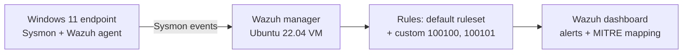

# Home SOC Lab: Wazuh + Sysmon detection engineering

Built by Edwin López | [LinkedIn](https://www.linkedin.com/in/edwin2390/)

A small home SOC built to practise the detection side of security operations: collect endpoint telemetry, see what the default ruleset catches, find the gaps, and close them with custom rules. Each detection is tested against a real endpoint and documented with the alert, the reasoning, and the limitations.

**Status:** Phase 1 (detection) complete. Phase 2 (case management, enrichment, AI-assisted triage) is planned and not built yet.

## Architecture



| Component | Details |
|---|---|
| Manager | Wazuh 4.14.8 all-in-one (manager, indexer, dashboard) on Ubuntu 22.04 in VirtualBox (4 GB RAM, 2 vCPU, 50 GB disk) |
| Endpoint | Windows 11 laptop with Sysmon v15.22 (SwiftOnSecurity config) and the Wazuh 4.14.8 agent |
| Network | VirtualBox host-only network between laptop and VM |

## Detections

| Technique | Behaviour tested | Detection | Rule | Level | Write-up |
|---|---|---|---|---|---|
| T1087 Account Discovery | `net user`, `net localgroup administrators` | Default ruleset | 92031 (plus 92033 for PowerShell origin) | 3 | [detections/T1087-account-discovery](phase1-detection/detections/T1087-account-discovery) |
| T1082 System Information Discovery | `systeminfo` | Custom rule (the default ruleset raised no alert) | 100100 | 6 | [detections/T1082-system-discovery](phase1-detection/detections/T1082-system-discovery) |
| T1547.001 Registry Run Keys | New value under the HKCU `Run` key | Custom rule, child of built-in rule 92300 | 100101 | 8 | [detections/T1547-registry-run-key](phase1-detection/detections/T1547-registry-run-key) |

The custom rules are in [phase1-detection/wazuh-manager](phase1-detection/wazuh-manager). Alert screenshots are in [screenshots](screenshots).

## What I learned

- **A default rule can match and still stay silent.** Wazuh's built-in rule 92300 recognises Run-key writes but is level 0, so it raises nothing. My first custom rule sat beside it and never fired. Making it a child of 92300 fixed it. The write-up shows how I ruled out Sysmon logging, delivery to the manager, and the pattern before finding that.
- **Check the gap before writing a rule.** For `systeminfo`, Sysmon logged the process but no default alert existed, so a custom rule was justified. For `net` commands, the default ruleset already covered it.
- **Triage the noise, don't assume.** The first discovery alert came from the Wazuh agent's own startup, not from my test. Integrity level and the working directory told them apart.
- **Validate before restarting.** Every rule change was backed up and tested with `wazuh-analysisd -t` before the manager restarted.
- **Disk sizing matters.** Ubuntu's installer used only about half of the 50 GB virtual disk for the root volume, and the Wazuh dashboard install failed with "No space left on device". Expanding the logical volume fixed it. VM snapshots at each milestone made recovery a one-minute rollback.
- **Tooling has limits.** `wazuh-logtest` cannot replay Windows event-channel events faithfully, so I tested rules against live events instead.

## Limitations

- One endpoint, and it is my own laptop, not an isolated VM, because of an 8 GB RAM limit. Tests were limited to harmless read-only commands and a reversible registry value.
- Single Sysmon configuration, no baselining, and alert levels are starting points, not tuned values. See each write-up for false-positive notes and tuning ideas.
- The detections test one behaviour each. Variants and evasions (renamed binaries, other Run-key locations) are listed as next steps in the write-ups.

## Planned: Phase 2

Case management (TheHive), threat-intelligence enrichment (MISP), automation (Shuffle), and local LLM-assisted alert triage (Ollama), with a write-up of where the model's classifications were right and wrong. Not started; the hardware limit above means these will be built one at a time.

## Repository layout

```
phase1-detection/
  detections/        one folder per technique: write-up + trimmed alert
  wazuh-manager/     custom rules
  log.md             build log
screenshots/         alert evidence
```
